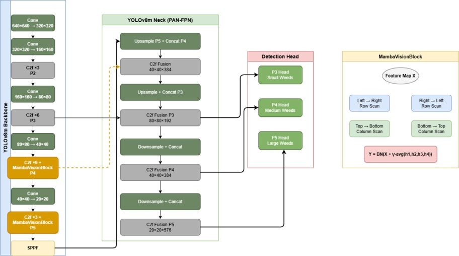
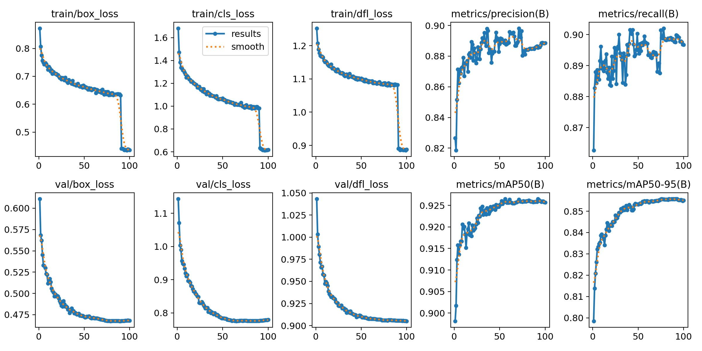
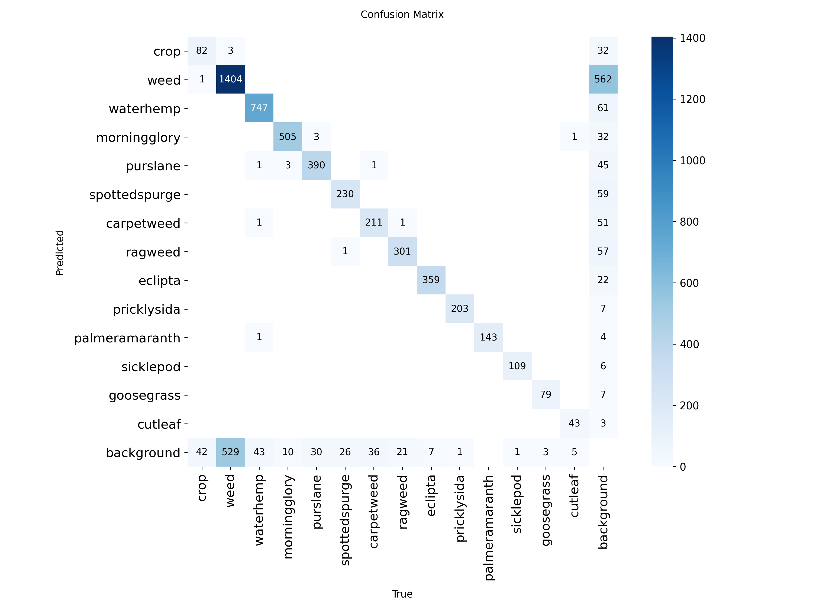

# MambaWeed

Fine-Grained Multi-Species Weed Detection Using Four-Directional State Space Modeling

## Overview

MambaWeed is a YOLOv8m-based weed detection framework that incorporates FourDirectionalMamba blocks to enhance long-range spatial modeling in agricultural scenes. The proposed architecture performs state-space scanning in four directions (left-to-right, right-to-left, top-to-bottom, and bottom-to-top) and selectively injects these modules into deeper feature extraction stages.

The framework is designed for fine-grained species-level weed detection in cotton farming environments, where accurate identification of individual weed species is critical for precision herbicide application and sustainable crop management.

The benchmark used in this work combines the CottonWeedDet12 and WeedCrop datasets into a unified 14-class weed detection dataset.

## Repository Structure

MambaWeed/
│
├── models/
│   └── mamba_block.py
│
├── scripts/
│   ├── train_baseline.py
│   ├── train_selective.py
│   ├── train_dense.py
│   └── inference.py
│
├── data/
│   └── dataset.yaml
│
├── results/
│
├── docs/
│
├── requirements.txt
├── LICENSE
└── README.md

## Dataset

Experiments were conducted on a unified benchmark created by combining two publicly available agricultural weed detection datasets:

* CottonWeedDet12
* WeedCrop

The merged dataset contains 14 classes and was divided into stratified training, validation, and test splits to ensure balanced evaluation across weed species.

The dataset configuration used for training is provided in:

data/dataset.yaml

## Results

The proposed MambaWeed architecture was evaluated against a standard YOLOv8m baseline and a dense Mamba injection variant.

| Model                 | mAP@50 | mAP@50-95 |
| --------------------- | ------ | --------- |
| YOLOv8m Baseline      | 92.0   | 85.5      |
| Dense Mamba           | 89.7   | 77.9      |
| MambaWeed (Selective) | 93.5   | 86.5      |

The results demonstrate that selective insertion of FourDirectionalMamba blocks into deeper feature extraction stages improves detection performance, whereas dense insertion throughout the network degrades accuracy.

## Training

### Baseline YOLOv8m

python scripts/train_baseline.py

### Selective MambaWeed

python scripts/train_selective.py

### Dense Mamba Ablation

python scripts/train_dense.py

Training uses the dataset configuration file:

data/dataset.yaml

## Inference

Run inference on an image, directory, or video using a trained checkpoint:

python scripts/inference.py \
--weights path/to/best.pt \
--source path/to/image_or_video

Example:

python scripts/inference.py \
--weights weights/mambaweed_best.pt \
--source test.jpg

## Architecture

MambaWeed extends YOLOv8m by introducing FourDirectionalMamba blocks that perform state-space scanning in four directions:

* Left → Right
* Right → Left
* Top → Bottom
* Bottom → Top

The outputs of the four directional scans are aggregated through a residual fusion mechanism and selectively inserted into deeper feature extraction stages.

## Citation

If you use this repository in your research, please cite:

Citation information will be added upon publication.

### Training Curves

### Confusion Matrix

## Model Variants

The repository contains three training configurations:

| Script             | Description                                                                   |
| ------------------ | ----------------------------------------------------------------------------- |
| train_baseline.py  | Standard YOLOv8m baseline                                                     |
| train_selective.py | Proposed MambaWeed architecture with selective FourDirectionalMamba insertion |
| train_dense.py     | Dense Mamba ablation with insertion after all C2f stages                      |

